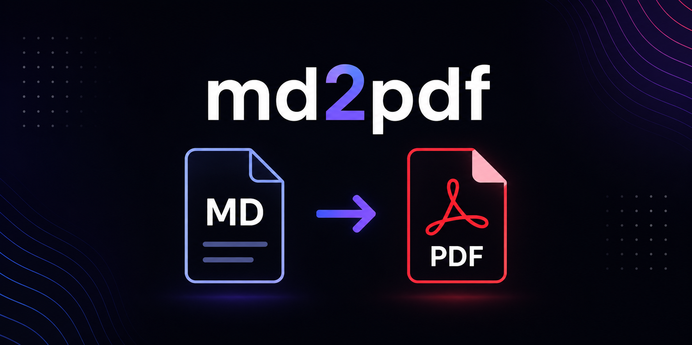

<p align="center">
  
</p>

<h1 align="center">md2pdf</h1>

Convert Markdown files into PDFs locally, without a TeX or LaTeX toolchain.

## Quick Start

Before you start, make sure you have:

- Node.js 20 or later installed.
- npm available in your terminal. npm is installed with Node.js.
- A supported browser installed, such as Google Chrome, Chromium, Microsoft
  Edge, Brave, Vivaldi, or Firefox.

Install md2pdf from npm:

```bash
npm install --global md2pdf
```

Check that the command is available:

```bash
md2pdf --help
```

Convert your first Markdown file:

```bash
md2pdf README.md
# creates README.pdf beside README.md
```

If your file is in another folder, go to that folder first:

```bash
cd path/to/your/folder
md2pdf README.md
```

To install from the GitHub source instead of npm:

```bash
git clone https://github.com/CognitiveSand/md2pdf.git
cd md2pdf
npm install --global .
md2pdf --help
```

## Install

After publication, the package can be used without administrator privileges:

```bash
npx md2pdf notes.md
npm install --global md2pdf
md2pdf --help
```

To run the CLI from a source checkout, one command builds and installs it:

```bash
npm install --global .
```

The `prepare` script compiles `dist/` during install, so `md2pdf` lands on your
`PATH` in one step -- no separate build or link, on Linux, macOS, or Windows.
Re-run the same command after pulling changes; `md2pdf --help` confirms it.

### Windows PowerShell Shim

On Windows, npm can generate both `md2pdf.cmd` and `md2pdf.ps1` shims. PowerShell
may resolve `md2pdf` to the `.ps1` shim first, and the local ExecutionPolicy can
block that script even when the `.cmd` shim is available.

Use the command shim directly when PowerShell blocks the script shim:

```powershell
md2pdf.cmd --help
```

Or invoke the command from `cmd.exe`:

```cmd
md2pdf --help
```

## Usage

```bash
md2pdf [OPTIONS] ENTRY [ENTRY ...]

ENTRY                     a Markdown file or a directory of Markdown files
-o, --output PATH         output path for a single-file conversion
    --output-dir DIR      write every output PDF into DIR
-f, --force-overwrite     overwrite existing output PDFs without prompting
-h, --help                list options with one-line descriptions
```

Examples:

```bash
md2pdf notes.md
md2pdf notes.md --output out/report.pdf
md2pdf a.md b.md --output-dir build
md2pdf ./notes-folder
md2pdf notes.md --force-overwrite
md2pdf --help
```

Directory conversion is non-recursive for v0.1: only top-level `.md` files in
the named directory are converted. The `.md` extension is matched
case-insensitively.

## Behavior Notes

- By default, `notes.md` writes `notes.pdf` beside the source.
- `--output` is valid only when exactly one Markdown file is produced. The
  extension is used verbatim; the CLI does not force `.pdf`.
- `--output-dir` uses each source file's base name.
- `--output` and `--output-dir` are mutually exclusive.
- Existing outputs are preserved unless `--force-overwrite` is supplied or an
  interactive overwrite prompt is accepted.
- In non-interactive mode, an existing output without `--force-overwrite` is
  skipped and counted in the final summary.
- Batch conversion continues after per-file conversion failures and prints a
  final summary: `<succeeded> succeeded, <failed> failed, <skipped> skipped`.

Exit codes:

- `0`: every conversion succeeded, or all existing outputs were skipped without
  conversion failures.
- `1`: at least one conversion failed.
- `2`: invalid command-line usage.

## Markdown Scope

md2pdf supports Markdown features such as headings, paragraphs, lists, tables,
task lists, footnotes, fenced code blocks, relative raster images (PNG, JPEG,
and WebP), and Mermaid code fences. Browser-backed tests cover the rendered PDF
behavior for the rich Markdown and Mermaid paths.

Images must be local relative files under the Markdown source directory. The
supported raster formats are PNG, JPEG, and WebP. SVG, GIF, remote image URLs,
absolute image paths, file URLs, unknown extensions, mismatched image content,
and symlinks that escape the source directory are rejected before rendering.

Safe HTTPS links remain clickable in the generated PDF. Non-HTTPS, local, and
active schemes such as `http:`, `javascript:`, `data:`, `file:`, `blob:`, and
`ftp:` are rendered as text links without an `href`. Remote scripts,
stylesheets, and images are not loaded from Markdown content.

Initial safety limits are enforced during rendering: Markdown documents up to
10 MB, individual lines up to 1 MB, up to 100 images, up to 50 Mermaid blocks,
Mermaid blocks up to 256 KB, highlighted code fences up to 1 MB, individual
images up to 20 MB, total embedded image bytes up to 100 MB, and image
dimensions up to 25 megapixels.

## Requirements

- Node.js 20 or later.
- One supported browser installed locally: Google Chrome, Chromium, Microsoft
  Edge, Brave, Vivaldi, or Firefox.
- A matching WebDriver binary declared in `artifacts.json` and selected by the
  artifact freshness policy, or a fallback browser/driver provisioned by md2pdf
  into a per-user cache from an eligible declared artifact.
- For a browser whose WebDriver ships bundled with it (such as the Firefox
  snap), md2pdf uses that bundled driver to drive that browser, validated by a
  compatibility check rather than the freshness policy.

`MD2PDF_BROWSER` may point the runtime converter at a specific browser
executable. It is an environment variable, not a CLI option:

```bash
MD2PDF_BROWSER=/usr/bin/chromium md2pdf notes.md
```

WebDriver binaries md2pdf provisions are runtime artifacts declared in
`artifacts.json`; md2pdf does not select arbitrary drivers from `PATH`. The sole
exception is a WebDriver bundled inside a user-installed browser (see the
Artifact Freshness Policy, "System-Bundled WebDriver"), used only to drive that
same browser and only after a compatibility check.

## Project Status

v0.1.2 is the current implementation. It covers the user-visible CLI surface,
browser-backed Markdown rendering, Mermaid diagrams, local WebDriver printing,
overwrite/skip behavior, batch summaries, npm packaging, artifact freshness
checks, and release validation paths.

## Development

```bash
npm ci
npm run typecheck
npm test
npm run test:contracts
npm run check:artifacts
npm run build
```

`npm test` runs fast unit and contract coverage. `npm run test:browser` runs the
browser-backed integration tests and requires a local browser plus an eligible
WebDriver declared in `artifacts.json`, or an eligible declared fallback
browser/driver artifact.
Local development may set `MD2PDF_SKIP_REAL_BROWSER_TESTS=1` to skip the real
browser proof explicitly; release evidence must run without that skip.

To smoke-test the exact tarball that would be published:

```bash
npm ci
npm pack
npm install --global --prefix /tmp/md2pdf-user ./<tarball-from-npm-pack>.tgz
/tmp/md2pdf-user/bin/md2pdf --help
```

Re-running the same install command converges on the same package version and
exits successfully.

## Artifact Freshness Policy

Every artifact in md2pdf must be the newest eligible version available after a
7-day quarantine period. The policy applies to npm dependencies, transitive
lockfile entries, bundled assets, drivers, browser fallback builds, generated
vendor files, runtime provisioning paths, and any future external artifact.

There is no emergency bypass or force mode. See
[`ARTIFACT_FRESHNESS_POLICY.md`](ARTIFACT_FRESHNESS_POLICY.md).

---

<p align="center">
  <a href="https://cognitivesand.ai">
    
  </a>
</p>

<p align="center">
  md2pdf is built by <strong>CognitiveSand</strong>.<br>
  Discover our work on secure, useful, and auditable AI —
  <a href="https://cognitivesand.ai">visit cognitivesand.ai&nbsp;→</a>
</p>
