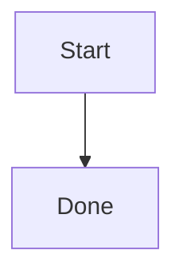

# md2pdf

Convert Markdown files into clean, shareable PDFs locally, with Mermaid support
and no TeX or LaTeX toolchain.

```bash
md2pdf report.md
# creates report.pdf beside report.md
```

## Status

v0.1.2 is the current MVP implementation track. The project is being rebuilt
from `src/`; any existing `dist/` output is historical and non-normative until a
fresh build regenerates it from source. The package is not release-ready until
the C0 contracts, browser-backed conversion, artifact checks, packlist, and
install evidence in `docs/release-evidence/release-checklist-v0.1.2.md` are
complete.

The target command converts Markdown through a local HTML document and prints
that document with an installed browser through WebDriver. All document assets
are local; Markdown sources and output PDFs are not uploaded to an external
service.

## Requirements

- Node.js 20 or later.
- One supported browser installed locally: Google Chrome, Chromium, another
  Chromium-family browser, or Firefox.
- A matching WebDriver binary declared in `artifacts.json` and selected by the
  artifact freshness policy, or a fallback browser/driver provisioned by md2pdf
  into a per-user cache from an eligible declared artifact.

Set `MD2PDF_BROWSER` to force a specific browser executable:

```bash
MD2PDF_BROWSER=/usr/bin/chromium md2pdf notes.md
```

WebDriver binaries are runtime artifacts. They must be declared in
`artifacts.json`; md2pdf does not select arbitrary drivers from `PATH`.

## Install

After publication, the package can be used without administrator privileges:

```bash
npx md2pdf notes.md
npm install --global md2pdf
md2pdf --help
```

For local development or release smoke testing:

```bash
npm ci
npm run build
npm pack
npm install --global --prefix /tmp/md2pdf-user ./<tarball-from-npm-pack>.tgz
/tmp/md2pdf-user/bin/md2pdf --help
```

Re-running the same install command converges on the same package version and
exits successfully.

## Usage

```bash
md2pdf [OPTIONS] ENTRY [ENTRY ...]

ENTRY                     a Markdown file or a directory of Markdown files
-o, --output PATH         output path for a single-file conversion
    --output-dir DIR      write every output PDF into DIR
-f, --force-overwrite     overwrite existing output PDFs without prompting
-h, --help                list options with one-line descriptions
```

Examples:

```bash
md2pdf notes.md
md2pdf notes.md --output out/report.pdf
md2pdf a.md b.md --output-dir build
md2pdf ./notes-folder
md2pdf notes.md --force-overwrite
```

Directory conversion is non-recursive for v0.1: only top-level `.md` files in
the named directory are converted.

## Output And Errors

- By default, `notes.md` writes `notes.pdf` beside the source.
- `--output` is valid only when exactly one Markdown file is produced.
- `--output-dir` writes every PDF into the given directory using the source base
  name.
- Existing outputs are preserved unless `--force-overwrite` is supplied or an
  interactive overwrite prompt is accepted.
- Batch conversion continues after per-file failures and prints a final summary.

Exit codes:

- `0`: every conversion succeeded, or all existing outputs were skipped without
  conversion failures.
- `1`: at least one conversion failed.
- `2`: invalid command-line usage.

## Markdown Support

v0.1 renders headings, paragraphs, lists, tables, task lists, footnotes, fenced
code blocks with syntax highlighting, relative images, and Mermaid code fences.

Mermaid fences use the browser path so diagrams render as diagrams rather than
raw code:

````markdown

````

## Development

```bash
npm ci
npm run typecheck
npm test
npm run check:artifacts
npm run build
npm run test:browser
```

`npm test` runs fast unit and contract coverage. `npm run test:browser` runs the
browser-backed integration tests and requires a local browser plus an eligible
WebDriver declared in `artifacts.json`, or an eligible declared fallback
browser/driver artifact.
Local development may set `MD2PDF_SKIP_REAL_BROWSER_TESTS=1` to skip the real
browser proof explicitly; release evidence must run without that skip.

## Artifact Freshness Policy

Every artifact in md2pdf must be the newest eligible version available after a
7-day quarantine period. The policy applies to npm dependencies, transitive
lockfile entries, bundled assets, drivers, browser fallback builds, generated
vendor files, runtime provisioning paths, and any future external artifact.

There is no exception or override. See
[`ARTIFACT_FRESHNESS_POLICY.md`](ARTIFACT_FRESHNESS_POLICY.md).
