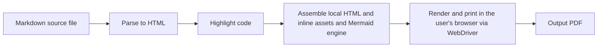

# md2pdf — Architecture

## 1. Purpose and scope

This document describes **how** md2pdf is built to satisfy the capabilities in
[`project_requirements.md`](project_requirements.md) and the stories in
[`user_stories.md`](user_stories.md). Where the requirements are deliberately
solution-free, this document names the mechanisms: language, libraries, the
conversion pipeline, the CLI surface, packaging, and the key risks.

This document is authoritative on internal structure. If any other document
describes a mechanism differently, this one wins; if it conflicts with a
*requirement*, the requirement wins and this document is the defect.

md2pdf is implemented in **TypeScript on Node.js 20+** (ADR-04) and renders by
driving **the user's own installed web browser** through the W3C WebDriver
protocol, using the browser's own print-to-PDF (ADR-01). Several load-bearing
decisions below were validated by hands-on spikes on 2026-06-02 (recorded under
`tmp/pw-research/`), including a full-fidelity render produced by stock Firefox.

## 2. Architectural drivers

The design is shaped by these requirements, in priority order:

| Driver | Source | Consequence for the design |
|---|---|---|
| Render Mermaid diagrams (Must, MVP) | FR-24 | A real browser renders Mermaid natively (including its HTML `foreignObject` labels) — no diagram-fidelity compromise. |
| Local-only, no network | CON-02, NFR-02 | All assets are inlined into a local HTML file; the page references no external URL and is loaded from `file:`. |
| No TeX/LaTeX toolchain (MVP) | CON-03 | Rendering goes through HTML + the browser's print engine, not LaTeX. |
| Zero configuration | NFR-01 | A single bundled stylesheet and sensible defaults; no config file is read for the common case. |
| User-scope install without sudo | FR-19 | npm distribution (`npx`/`npm i -g`); the renderer reuses an already-installed browser, so the common case needs no browser download at all. |
| One command, simple UX | Description objective | A single `md2pdf` console command; beside-the-source output by default. |
| Node.js ≥ 20 | CON-01 | Modern Node: built-in `node:util` argument parsing, native ESM. |

## 3. Central decision — render through the user's installed browser

**Decision.** md2pdf converts each document in two transformations —
**Markdown → HTML**, then **HTML → PDF** — and performs the HTML → PDF step by
driving an **already-installed web browser** over the W3C WebDriver protocol and
invoking the browser's standard **Print** command. Both browser families are
supported: Chromium-family (Chrome / Edge / Brave / Chromium) via `chromedriver`,
and Firefox via `geckodriver`.

**Why the user's browser.** A real browser renders the full document — prose,
tables, highlighted code, embedded images (FR-06), correct pagination (FR-07),
and Mermaid diagrams *natively*, including the HTML `foreignObject` labels that
non-browser SVG renderers drop. Reusing the browser the user already has means
the common case needs **no multi-hundred-MB download** and **no elevation**,
which is the project's simplicity and no-sudo priority. The earlier candidate of
downloading a bundled Chromium as the primary path was rejected (ADR-01
alternatives) because the download and its Linux system-library needs are the
heaviest, most failure-prone part of the install — and unnecessary when a
browser is already present. The separate Chromium-for-Testing fallback is a
last-resort provisioning path governed by `artifacts.json` and the artifact
freshness policy, not the common rendering path.

**Validated.** A spike drove the system Firefox headless via geckodriver,
rendered a document containing a default-`htmlLabels` Mermaid flowchart
(`foreignObject` intact), and produced a faithful PDF with the WebDriver Print
command — no bundled browser, no SVG-to-PDF conversion step.

Alternatives (bundled Chromium; a fully browser-free Typst + resvg stack) and
the residual risks are in §13 (ADRs) and §14 (Risks).

## 4. Conversion pipeline

A single document flows through five stages. Stages 1–3 run in Node and are pure
functions of their input plus local assets; only stage 4 touches a browser.



1. **Parse to HTML.** The Markdown source is parsed to HTML covering the
   supported dialect (CommonMark plus tables, task lists, footnotes) with
   markdown-it and its plugins. Fenced code tagged `mermaid` is emitted as a
   diagram placeholder (`<pre class="mermaid">`), left for the browser to render.
2. **Highlight code.** Non-Mermaid fenced code blocks are highlighted in Node
   (highlight.js) and emitted as styled HTML (FR-05).
3. **Assemble local HTML.** The fragment is wrapped in a full HTML document with
   the default stylesheet, the highlight.js theme, fonts, and the Mermaid engine
   (resolved from the installed `mermaid` dependency) all inlined. The document
   references no external URL, and the base directory is the source file's
   directory so relative images resolve (FR-06). The file is written to a
   per-run temporary path.
4. **Render and print.** md2pdf launches the located browser headless via
   WebDriver, loads the local HTML over `file:`, waits until the Mermaid engine
   reports completion, then invokes the WebDriver Print command with print
   parameters (page size, margins, background) to obtain the PDF bytes.
5. **Write the output PDF** to the resolved output path, subject to the
   overwrite policy (§7). The PDF is written only after a full render succeeds.

### Public conversion contracts

C0 exposes a minimal conversion API before the full implementation exists. These
contracts are the shared boundary between the CLI/batch orchestration and the
single-document converter.

```ts
export interface ConvertOptions {
  browserPath?: string;
  renderTimeoutMs?: number;
}

export interface ConversionJob {
  sourcePath: string;
  outputPath: string;
  originEntry: string;
  options: ConvertOptions;
}

export type ConversionStatus = 'success' | 'failed' | 'skipped';

export interface ConversionOutcome extends ConversionJob {
  status: ConversionStatus;
  error?: Md2pdfError;
}

export async function convertFile(
  sourcePath: string,
  outputPath: string,
  options?: ConvertOptions,
): Promise<void>;
```

`ConvertOptions` is the public, intentionally small option bag for one
conversion. `browserPath` may pin a browser binary, and `renderTimeoutMs` limits
browser rendering and Mermaid completion; C0 must document the default timeout
before any production implementation relies on it.

`ConversionJob` represents a planned conversion after path resolution and
preflight. `sourcePath` and `outputPath` are already resolved for execution,
`originEntry` preserves the user-supplied file or directory entry for reporting,
and `options` carries the per-job conversion settings.

`ConversionOutcome` is the batch-facing result used for stdout summaries and
exit status decisions. It extends `ConversionJob` so every outcome preserves the
resolved source path, resolved output path, original user entry, and conversion
options that produced it. A successful outcome has `status: 'success'` and no
`error`; a failed outcome carries the `Md2pdfError`; a skipped outcome has
`status: 'skipped'` and preserves the output path that was not overwritten.

`convertFile` converts exactly one Markdown source file to exactly one output
path. It resolves no batch behavior and emits no summary. On failure it throws a
typed `Md2pdfError`; callers such as `ConversionPipeline` catch that exception
and turn it into a `ConversionOutcome`. The output PDF is written only after a
complete render succeeds, so a failed conversion must not leave a partial PDF at
the target path.

## 5. Component view

Modules under `src/`. Each owns one concern (SRP) and stays within the
40-line-function / 300-line-module limits.

| Module | Component | Responsibility | Serves |
|---|---|---|---|
| `cli.ts` | command-line front end | Parse arguments with `node:util` `parseArgs`, wire components, set the process exit code. | FR-13, FR-17, FR-18, NFR-04 |
| `pipeline.ts` | `ConversionPipeline` | Transform CLI entries into `ConversionJob[]`, reject global preflight conflicts, execute conversions, continue past per-document failures, collect `ConversionOutcome[]`, and emit the outcome summary. | FR-08, FR-09, FR-10, FR-11 |
| `converter.ts` | `DocumentConverter` | Orchestrate one conversion through Markdown parsing, local HTML assembly, browser rendering, and atomic PDF writing. | FR-01, FR-04–07, FR-16, FR-24 |
| `markdownRenderer.ts` | `MarkdownToHtmlRenderer` | Stages 1–3: Markdown to a full, self-contained local HTML document with code highlighting and the inlined Mermaid engine. | FR-04, FR-05, FR-06, FR-24 |
| `browserLocator.ts` | `BrowserLocator` | Detect an installed Chromium-family or Firefox browser, resolve the real binary including snap wrappers, and find or request a compatible WebDriver. It does not own fallback browser policy. | FR-19, NFR-03 |
| `pdfRenderer.ts` | `WebDriverPdfRenderer` | Stage 4: load the local HTML in the located browser via WebDriver, await Mermaid completion, and return PDF bytes from the Print command. | FR-07, FR-24, NFR-02 |
| `releaseCatalog.ts` | `ReleaseCatalog` | Read `artifacts.json` and expose declared non-npm artifact releases, platforms, immutable URLs, sizes, checksums, and provenance. | NFR-05 |
| `artifactPolicy.ts` | `ArtifactPolicy` | Validate artifact eligibility, 7-day freshness, checksum SHA-256, compatibility constraints, and `newest eligible` selection. | NFR-05 |
| `fallbackBrowserProvisioner.ts` | `FallbackBrowserProvisioner` | Provision Chromium-for-Testing only as a last resort after `ReleaseCatalog` and `ArtifactPolicy` approve an eligible fallback artifact. | FR-19, NFR-03, NFR-05 |
| `paths.ts` | `OutputPathResolver`, `ConversionEntryResolver` | Resolve default / explicit / `--output-dir` output paths; expand a directory entry to its top-level Markdown files. | FR-02, FR-03, FR-09, FR-23 |
| `overwrite.ts` | `OverwritePolicy` | Decide overwrite vs preserve from the force flag and terminal interactivity. | FR-12, FR-13, FR-14 |
| `errors.ts` | `Md2pdfError` hierarchy | Typed, fail-loud errors carrying offending paths, artifact context, missing-browser causes, and action hints. | FR-15, FR-16, FR-17 |
| `assets/` | bundled resources | Default CSS, highlight.js theme CSS, fonts — all local. | NFR-01, NFR-02 |

## 6. Command-line surface

A single console command. Argument parsing uses the built-in `node:util`
`parseArgs` (no third-party CLI dependency for the MVP).

```
md2pdf [OPTIONS] ENTRY [ENTRY ...]

ENTRY                     a Markdown file or a directory of Markdown files
-o, --output PATH         output path for a single-file conversion (FR-03)
    --output-dir DIR      write every output PDF into DIR (FR-23)
-f, --force-overwrite     overwrite existing output PDFs without prompting (FR-13)
-h, --help                list options with one-line descriptions (NFR-04)
```

The `MD2PDF_BROWSER` environment variable may pin an explicit browser binary,
overriding detection. `--output` and `--output-dir` are mutually exclusive;
`--output` is rejected when more than one document would be produced. These are
usage errors (§8).

## 7. Overwrite policy

`OverwritePolicy` is a pure decision over three inputs: whether the output PDF
already exists, whether `--force-overwrite` was given, and whether the process
runs in an interactive terminal session (both stdin and stdout are TTYs,
detected with `process.stdin.isTTY` / `process.stdout.isTTY`).

| Output exists | `-f` given | Interactive | Decision |
|---|---|---|---|
| no | — | — | write |
| yes | yes | — | overwrite (FR-13) |
| yes | no | yes | prompt; default No preserves the file (FR-12) |
| yes | no | no | preserve; report skip on stderr (FR-14) |

The force flag takes precedence over interactivity, so a forced overwrite is
honored in scripts and pipes (FR-13, second scenario in US-05).

## 8. Error handling and exit status

Fail loud, fail early. `errors.ts` defines a single root `Md2pdfError`; every
thrown error is a subclass carrying its context. The CLI front end is the only
layer that converts errors to messages and exit codes.

- **Per-document failures** (missing/unreadable input → `InputNotFoundError`;
  un-renderable content → `RenderError`) are reported on stderr with the
  offending path. Inside a batch the pipeline catches them, records a failure,
  and continues (FR-10, FR-15, FR-16). No partial output PDF is written.
- **No usable browser** → `BrowserNotFoundError` reported once on stderr with
  guidance (install Chrome/Edge/Firefox, or set `MD2PDF_BROWSER`). Its cause
  must distinguish the observable reason: no compatible installed browser,
  detected browser with no eligible driver, no Chromium-for-Testing fallback
  declared in `artifacts.json`, fallback rejected by checksum/freshness/platform,
  or an unusable provisioning cache.
- **Exit status**, set once at process end:
  - `0` — every conversion succeeded (FR-18).
  - `1` — at least one conversion failed (FR-17).
  - `2` — invalid command-line usage (mutually exclusive options, no entry).

## 9. Local-only enforcement

CON-02 / NFR-02 apply to conversion, not to artifact provisioning. md2pdf keeps
these two phases separate:

- **Provisioning** may use the network before conversion to retrieve an approved
  driver or last-resort fallback browser. Provisioning never reads the Markdown
  source or output PDF contents, and every provisioned artifact must pass
  `ReleaseCatalog` and `ArtifactPolicy`.
- **Conversion** is strictly local-only. Once a Markdown file is being converted
  to a PDF, md2pdf performs no downloads and opens no outbound network
  connection.

Because WebDriver does not offer Playwright-style request interception, the
conversion guarantee is structural:

- All assets (stylesheets, fonts, the Mermaid engine) are inlined into the
  generated HTML; no CDN or external URL appears in it.
- The HTML is loaded from a local `file:` path, and the browser is launched with
  offline/no-proxy preferences so it cannot reach the network.
- A test asserts the assembled HTML contains no external (`http:`/`https:`) URL,
  and that conversion succeeds with the host network disabled from a
  pre-provisioned state.

## 10. Styling and assets

A single bundled `default.css` provides the zero-configuration look (body
typography, margins, table and code styling) and the print rules. Heading orphan
avoidance (FR-07) is expressed in CSS:

```css
h1, h2, h3, h4, h5, h6 { break-after: avoid-page; }
```

Both Chromium and Firefox honor CSS paged-media break rules in their print
engines, so the same stylesheet works across browser families. Fonts are bundled
so output is consistent regardless of host-installed fonts. A highlight.js theme
stylesheet styles the server-highlighted code. Theme selection is out of scope
(OOS-03); the stylesheet is fixed for the MVP.

## 11. Packaging, installation, and distribution

- md2pdf ships as an npm package with a `bin` entry named `md2pdf`.
  `package.json` is the single source of truth; the lockfile is committed.
  TypeScript compiles to `dist/`; the `bin` points at `dist/cli.js`.
- **Zero-install and no-sudo use (FR-19).** `npx md2pdf file.md` runs without any
  prior global install; `npm i -g md2pdf` installs a per-user global on the PATH
  without elevation. Validated: installing the npm packages required no sudo.
- **Browser and driver provisioning (ADR-05).** On first run `BrowserLocator`
  detects an installed Chromium-family or Firefox browser and resolves a matching
  WebDriver, provisioning `chromedriver`/`geckodriver` (small binaries, per-user
  cache, no sudo) only through artifacts accepted by `ReleaseCatalog` and
  `ArtifactPolicy`. The common case needs **no browser download**.
- **Chromium-for-Testing fallback.** If no installed browser path is usable,
  `FallbackBrowserProvisioner` may provision Chromium-for-Testing plus its
  chromedriver into the per-user cache, but only as a last resort. The fallback
  is allowed only when the concrete artifact is declared in `artifacts.json`,
  selected as `newest eligible`, compatible with the host platform, and verified
  by SHA-256 checksum and freshness policy. If no eligible artifact exists,
  md2pdf fails with `BrowserNotFoundError` whose cause states that no fallback
  artifact is eligible. The current empty `artifacts.json` means the fallback is
  planned but not available until a declared artifact is added.
- **System-scope install (FR-20).** Installing the package into a system-shared
  location with elevation places the `md2pdf` entry point on every account's
  PATH; each user's browser/driver are resolved per-user on first run.
- **Idempotency (FR-21).** Install and upgrade are npm operations that converge
  on the target version and exit `0` whether or not md2pdf is already present
  (`npm i -g md2pdf@<version>`); re-running never errors on an installed host.

## 12. Project structure

```
md2pdf/
  package.json              # metadata, deps, "bin": { "md2pdf": "dist/cli.js" }
  package-lock.json         # committed
  tsconfig.json
  README.md
  docs/
    project_description.md
    project_requirements.md
    user_stories.md
    architecture.md          # this document
  src/
    cli.ts                   # argument parsing, wiring, exit codes
    pipeline.ts              # ConversionPipeline
    converter.ts             # DocumentConverter
    markdownRenderer.ts      # MarkdownToHtmlRenderer
    browserLocator.ts        # BrowserLocator
    releaseCatalog.ts        # ReleaseCatalog
    artifactPolicy.ts        # ArtifactPolicy
    fallbackBrowserProvisioner.ts
    pdfRenderer.ts           # WebDriverPdfRenderer
    paths.ts                 # OutputPathResolver, ConversionEntryResolver
    overwrite.ts             # OverwritePolicy
    errors.ts                # Md2pdfError hierarchy
  assets/
    default.css
    highlight.css            # highlight.js theme
    fonts/
  dist/                      # tsc output (gitignored)
  tests/
    unit/                    # per-component, no browser
    integration/             # full md → pdf, browser-backed (marked slow)
    contract/                # CLI options, exit codes, stderr messages
```

## 13. Architecture decision records

**ADR-01 — Render via the user's installed browser using WebDriver Print.**
*Context:* FR-24 requires faithful Mermaid; a real browser renders it natively
(including `foreignObject`), and most desktops already have a browser. *Decision:*
drive an installed browser over WebDriver and use its Print command for HTML→PDF,
rather than bundling/downloading a Chromium as the primary browser path or
assembling the PDF without a browser. *Alternatives rejected:* (a) bundled
Chromium via Playwright as the main path — heavy download and Linux
system-library/no-sudo problems, and cannot drive stock Firefox; (b)
browser-free Typst + resvg — needs `htmlLabels:false` (a
fidelity risk on exotic diagram types) and a non-HTML body engine. *Consequences:*
no browser download in the common case and full fidelity (positive); per-browser
driver version management and slight output variation across browser versions
(negative, see R-1/R-2). *Status:* accepted; validated by the stock-Firefox spike.

**ADR-02 — Inline all assets into local HTML; never reference a CDN.**
*Context:* CON-02 forbids network access, and WebDriver lacks request
interception. *Decision:* inline the Mermaid engine, stylesheets, and fonts into
the generated HTML, load it over `file:`, and launch the browser offline.
*Consequences:* a hard, testable local-only guarantee (positive); a deliberate
dependency-bump step for the inlined engine version (negative). *Status:*
accepted.

**ADR-03 — Highlight code at HTML assembly with highlight.js.**
*Context:* FR-05 needs syntax highlighting. *Decision:* highlight in Node and emit
styled HTML rather than in the browser. *Consequences:* highlighting is
unit-testable without a browser (positive); engine and theme stylesheet must
agree (minor coupling). *Status:* accepted.

**ADR-04 — Implement in TypeScript on Node.js.**
*Context:* Mermaid, markdown-it, and the WebDriver clients are all
JavaScript-native; the user's global default is Python. *Decision:* implement in
TypeScript/Node, overriding the Python default for this project, on explicit user
approval (2026-06-02). *Consequences:* one language and one runtime, `npx`
zero-install distribution (positive); divergence from the team's Python tooling
(negative, accepted). *Status:* accepted.

**ADR-05 — Prefer an installed browser; split browser detection from artifact
policy and fallback provisioning.**
*Context:* the WebDriver path needs a browser plus a compatible WebDriver binary;
most desktops already have a browser, drivers are smaller than browsers, and all
runtime provisioning is governed by `ARTIFACT_FRESHNESS_POLICY.md`. *Decision:*
`BrowserLocator` detects installed Chromium-family or Firefox browsers and
resolves compatible drivers; `ReleaseCatalog` reads declared non-npm artifacts
from `artifacts.json`; `ArtifactPolicy` applies `newest eligible`, freshness and
SHA-256 verification; `FallbackBrowserProvisioner` provisions
Chromium-for-Testing only when no installed browser path is available and the
fallback artifact passes policy. *Consequences:* no browser download in the
common case, no sudo for per-user caches, and an auditable supply-chain boundary
for fallback artifacts (positive); more modules and more artifact-policy tests
for browser-less hosts (negative). *Status:* accepted.

## 14. Key risks

- **R-1 — Browser/driver availability and version lockstep.** `chromedriver`'s
  major version must match the installed Chrome; `geckodriver` is version
  tolerant. A host may have no browser at all, may have a browser with no
  eligible driver, or may have no eligible fallback artifact in `artifacts.json`.
  The snap-packaged Firefox on Ubuntu exposes a wrapper script at
  `/usr/bin/firefox`; the real binary
  (`/snap/firefox/current/usr/lib/firefox/firefox`) must be resolved.
  *Mitigations:* resolve the real binary behind snap wrappers; provision only
  drivers accepted by `ArtifactPolicy`; use `FallbackBrowserProvisioner` only
  after installed browsers fail; raise `BrowserNotFoundError` with a cause such
  as no compatible browser, no eligible driver, or no eligible fallback artifact.
- **R-2 — Output variation across browsers/versions.** Firefox and Chrome render
  slightly differently, and a user's browser auto-updates. *Mitigation:* document
  this and test semantic rendering expectations rather than byte identity.
- **R-3 — Conversion offline guarantee is structural, not intercepted.** Without
  request interception, local-only rendering relies on inlined assets, `file:`
  loading, and offline/no-proxy browser launch. This risk concerns conversion
  only; provisioning is a separate pre-conversion artifact-policy concern.
  *Mitigation:* a test asserting no external URLs in the assembled HTML and a
  network-disabled conversion test from a pre-provisioned state (NFR-02).
- **R-4 — Inlined engine/asset version drift.** The Mermaid engine and
  highlight.js are pinned dependencies updated deliberately. *Mitigation:* pin in
  `package.json`; treat updates as scoped dependency changes.

## 15. Verification mapping

| Requirement | Verified by |
|---|---|
| FR-01, FR-02 | integration test: single file → `name.pdf` beside source |
| FR-03, FR-23 | contract test: `--output` / `--output-dir` path resolution |
| FR-04 | integration test: tables, task lists, footnotes present in PDF text layer |
| FR-05 | unit test: highlight.js markup emitted for tagged code |
| FR-06 | integration test: relative image embedded |
| FR-07 | integration test: no heading is the last line on a page |
| FR-08–11 | integration + contract tests: multi-file and folder batch, continue-on-error, summary |
| FR-12–14 | unit test: `OverwritePolicy` truth table; contract test: prompt and skip paths |
| FR-15–18 | contract test: stderr messages and exit codes; `BrowserNotFoundError` path |
| FR-19–21 | install demonstration on a non-privileged account; idempotent re-run exits 0 |
| FR-24 | integration test: a `mermaid` block renders as vector graphics, not raw text (validated on stock Firefox) |
| NFR-01 | integration test: conversion with no config file present |
| NFR-02 | test: no external URL in assembled HTML; conversion with host network disabled from a pre-provisioned state |
| NFR-03 | CI matrix: Linux, macOS, Windows on Node.js 20+, against Chromium and Firefox |
| NFR-04 | contract test: `--help` lists every option |
| NFR-05 | artifact-policy tests: `ReleaseCatalog`, `ArtifactPolicy`, checksum SHA-256, `newest eligible`, and fallback rejection when no declared artifact is eligible |

Tests use a fast unit/contract path and a browser-backed integration path; the
slow browser tests are isolated so the iteration loop stays fast. Each test is
tagged with its requirement ID so the traceability matrix is generated from the
suite.

## 16. P0 alignment checklist

This checklist is the documentation-level guard that `docs/architecture.md` no
longer diverges from the v0.1.2 P0 plan before C0 starts.

| P0 item | Architecture location |
| --- | --- |
| Public contracts `ConvertOptions`, `ConversionJob`, `ConversionOutcome`, `convertFile` | §4 Public conversion contracts |
| `ConversionPipeline` and `DocumentConverter` responsibilities | §5 Component view |
| `BrowserLocator` / `ReleaseCatalog` / `ArtifactPolicy` / `FallbackBrowserProvisioner` split | §5 Component view, §11 Packaging, §13 ADR-05 |
| Chromium-for-Testing last-resort fallback, declared artifact, `newest eligible`, SHA-256 and freshness gates | §11 Packaging, §13 ADR-05, §14 R-1 |
| `BrowserNotFoundError` causes for missing browser, missing driver and no eligible fallback | §8 Error handling, §14 R-1 |
| Provisioning may use network; conversion is local-only with `file:` and inlined assets | §9 Local-only enforcement, §14 R-3 |
| ADR-05 updated for separated responsibilities | §13 Architecture decision records |
| R-1 and R-3 updated for fallback eligibility and conversion-only offline risk | §14 Key risks |
| Release evidence remains outside architecture and is created under `docs/release-evidence/` | P0 phases 3-5 |
