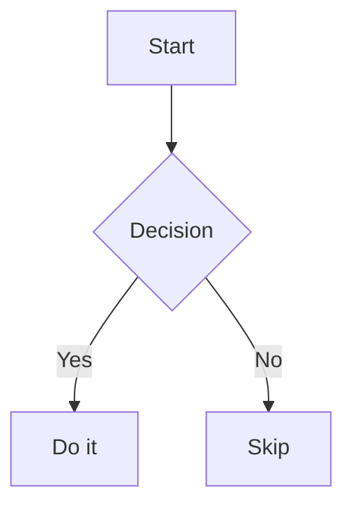

# Sample Document

A paragraph with **bold**, _italic_, and `inline code`.

## Tables

| Name  | Role    | Active |
|-------|---------|--------|
| Alice | Admin   | Yes    |
| Bob   | Member  | No     |

## Task Lists

- [x] Completed task
- [ ] Pending task
- [x] Another done item

## Footnotes

This sentence has a footnote[^1].

[^1]: This is the footnote content.

## Code Block

```javascript
function greet(name) {
  console.log(`Hello, ${name}!`);
}
```

## Mermaid



## Unordered List

- Item one
- Item two
  - Nested item
  - Another nested item
- Item three

## Blockquote

> This is a blockquote.
> It can span multiple lines.
