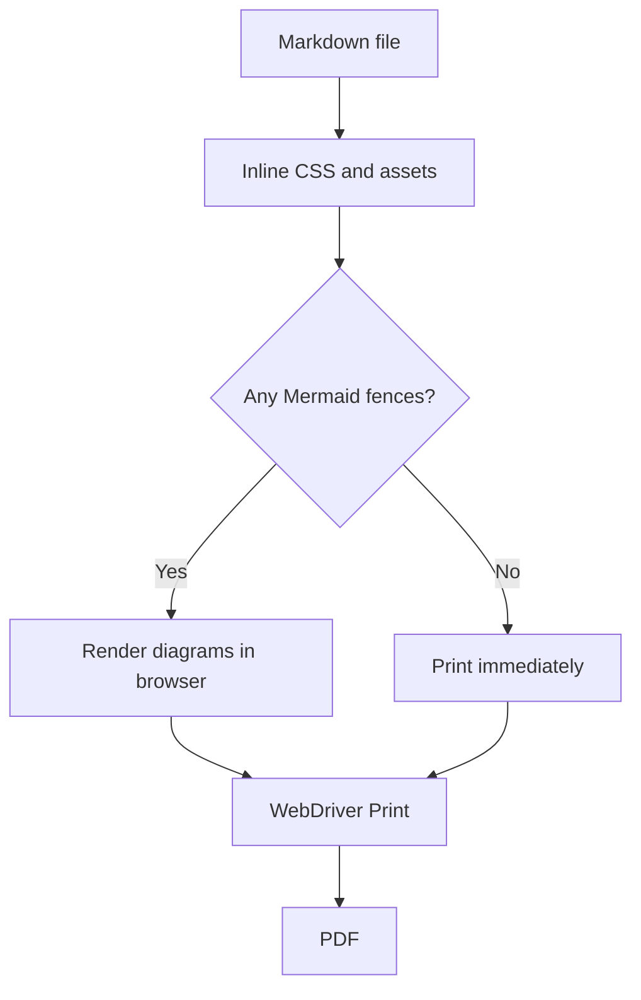
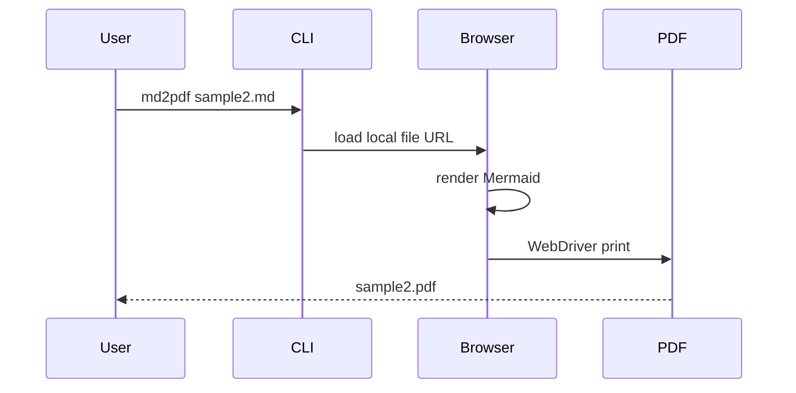

# Sample 2 Stress Document

This fixture is intentionally dense. It mixes long prose, nested structures,
tables, footnotes, code blocks, Mermaid diagrams, relative images, and linked
images so the PDF renderer has to exercise most of the v0.1 path at once.

## Table Of Contents

- [Executive Summary](#executive-summary)
- [Local Images](#local-images)
- [Dense Tables](#dense-tables)
- [Code Samples](#code-samples)
- [Mermaid Diagrams](#mermaid-diagrams)
- [Long Lists And Notes](#long-lists-and-notes)
- [Appendix](#appendix)

## Executive Summary

The document should remain readable when converted to PDF. Headings should stay
with nearby content, tables should not collapse, code blocks should keep their
highlighting, and Mermaid diagrams should render as diagrams instead of raw
source text.[^summary-note]

> A conversion tool is useful only when the boring cases and the awkward cases
> both survive the same command.

The quick command for this fixture is:

```bash
node dist/cli.js tests/fixtures/sample2.md --output /tmp/sample2.pdf --force-overwrite
```

## Local Images

The same tiny local image is used in several Markdown positions. It is linked by
relative path and should be embedded as a data URI by the HTML renderer.


Linked image:

[](#dense-tables)

Image inside a list:

- Primary evidence: 
- Secondary evidence links back to [the appendix](#appendix).
- A nested image path:
  - 

## Dense Tables

| Area | Expected Behavior | Fixture Pressure | Status |
|---|---|---:|---|
| Markdown | Headings, paragraphs, lists, footnotes | 5 | Pass |
| Images | Relative image embedding | 5 | Pass |
| Code | Highlighted fenced blocks | 4 | Pass |
| Mermaid | Browser-rendered diagrams | 5 | Pass |
| Batch | Multiple files and output dirs | 3 | Covered elsewhere |

| Step | Owner | Input | Output | Notes |
|---:|---|---|---|---|
| 1 | CLI | `sample2.md` | work item | validates arguments |
| 2 | Renderer | Markdown text | local HTML | no external URLs |
| 3 | Browser | `file:` HTML | PDF bytes | waits for Mermaid |
| 4 | Converter | PDF bytes | `/tmp/sample2.pdf` | writes after success |

## Task Matrix

- [x] Build the TypeScript output.
- [x] Run the command through the CLI entrypoint.
- [ ] Manually inspect line wrapping in the generated PDF.
- [ ] Manually inspect Mermaid labels in the generated PDF.
- [x] Keep every asset local to the repository.

## Code Samples

TypeScript:

```typescript
type ConversionStatus = 'success' | 'failed' | 'skipped';

interface ConversionSummary {
  succeeded: number;
  failed: number;
  skipped: number;
}

export function formatSummary(summary: ConversionSummary): string {
  return `Summary: ${summary.succeeded} succeeded, ${summary.failed} failed, ${summary.skipped} skipped.`;
}
```

JSON:

```json
{
  "entry": "tests/fixtures/sample2.md",
  "output": "/tmp/sample2.pdf",
  "forceOverwrite": true,
  "localOnly": true
}
```

Unknown language fence:

```not-a-real-language
this should still render as a safe highlighted plaintext block
with <angle brackets>, ampersands &, and "quotes".
```

## Mermaid Diagrams

Flowchart:



Sequence:



## Long Lists And Notes

1. First ordered item with a paragraph below it.

   The continuation paragraph checks indentation and spacing.

2. Second ordered item with nested bullets:
   - Nested bullet one with `inline code`.
   - Nested bullet two with **bold text** and _italic text_.
   - Nested bullet three with a local image: 

3. Third ordered item with a blockquote:

   > Nested quote inside an ordered list.
   > It should preserve readable spacing.

Definition-like notes:

- Renderer:
  Converts Markdown to a self-contained local HTML document.
- Browser:
  Opens the local file URL and prints it through WebDriver.
- Output:
  The PDF should be written only after rendering succeeds.

## Appendix

This final section includes repeated references to footnotes and internal links.
The phrase local-only appears here because the conversion must not fetch images,
styles, fonts, or scripts from a network location.[^local-only]

Return to [Local Images](#local-images) or [Mermaid Diagrams](#mermaid-diagrams).

[^summary-note]: This note checks that footnote references and footnote bodies
    survive a longer, mixed-content document.

[^local-only]: The only image paths in this file point to `pixel.png`, which is
    already present next to this fixture.
